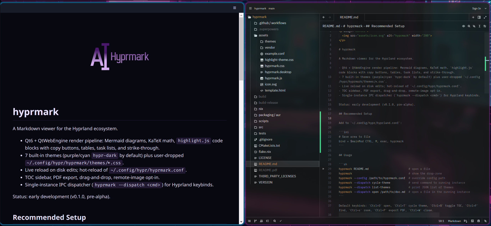

<p align="center">
  
</p>

# hyprmark

<p align="center">
  <a href="https://github.com/robinduckett/hyprmark/actions/workflows/ci.yml"></a>
  <a href="https://github.com/robinduckett/hyprmark/actions/workflows/release.yml"></a>
  <a href="https://github.com/robinduckett/hyprmark/releases/latest"></a>
  <a href="LICENSE"></a>
</p>

A Markdown viewer for the Hyprland ecosystem.

<p align="center">
  
</p>

- Qt6 + QtWebEngine render pipeline: Mermaid diagrams, KaTeX math, `highlight.js` code blocks with copy buttons, tables, task lists, and strike-through.
- 7 built-in themes (purple/cyan `hypr-dark` by default) plus user-dropped `~/.config/hypr/hyprmark/themes/*.css`.
- Live reload on disk edits; hot-reload of `~/.config/hypr/hyprmark.conf`.
- TOC sidebar, PDF export, drag-and-drop, remote-image opt-in.
- Single-instance IPC dispatcher (`hyprmark --dispatch <cmd>`) for Hyprland keybinds.

Status: early development (v0.1.0, pre-alpha).

## Recommended Setup

Add to `~/.config/hypr/hyprland.conf` (or wherever you keep user binds):

```ini
# Launch hyprmark (empty drop-zone window)
bind = $mainMod CTRL, M, exec, hyprmark

# Optional: dispatcher bindings for a running instance
bind = $mainMod CTRL, T, exec, hyprmark --dispatch cycle-theme
bind = $mainMod CTRL, B, exec, hyprmark --dispatch toggle-toc
```

Note hyprland bind syntax: four comma-separated fields — `MODS, KEY, DISPATCHER, PARAMS`. `exec` is the dispatcher; the command it runs is a separate arg after the comma.

## Usage

```sh
hyprmark README.md                        # open a file
hyprmark                                  # show the drop-zone
hyprmark --config /path/to/hyprmark.conf  # override config path
hyprmark --dispatch cycle-theme           # send command to running instance
hyprmark --dispatch list-themes           # print JSON list of themes
hyprmark --dispatch open /path/to/doc.md  # open a file in the running instance
```

Default keybinds: `Ctrl+O` open, `Ctrl+T` cycle theme, `Ctrl+B` toggle TOC, `Ctrl+F` find, `Ctrl+±` zoom, `Ctrl+P` export PDF, `Ctrl+W` close.

## Hyprland binds

```conf
bind = $mainMod, T, exec, hyprmark --dispatch cycle-theme
bind = $mainMod, N, exec, hyprmark --dispatch toggle-toc
```

## Configuration

`~/.config/hypr/hyprmark.conf` is parsed by `hyprlang`; changes apply live. See [`assets/example.conf`](assets/example.conf) for the full option surface.

```
general {
    default_theme = hypr-dark
    live_reload = true
    allow_remote_images = false
}
```

## Build

```sh
cmake --no-warn-unused-cli -DCMAKE_BUILD_TYPE=Release -S . -B build
cmake --build build -j$(nproc)
sudo cmake --install build  # optional, installs to /usr/local by default
```

Runtime dependencies: `qt6-base`, `qt6-wayland`, `qt6-webengine`, `qt6-webchannel`, `md4c`, `hyprlang`, `hyprutils`. Debug builds also need `gtest`.

## Nix

```sh
nix build .#
./result/bin/hyprmark README.md
```

## License

BSD-3-Clause. See [`LICENSE`](LICENSE).
